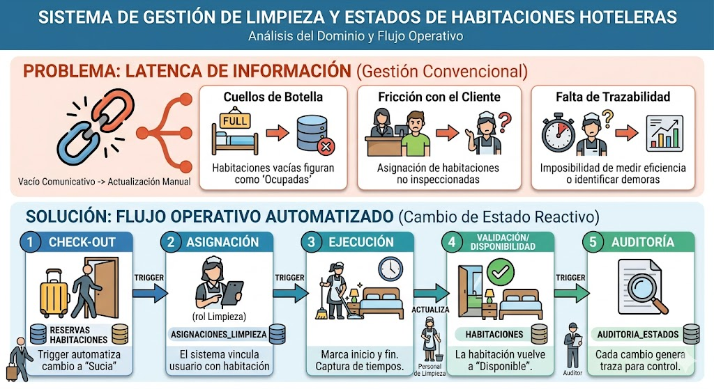

# PLANTIEAMIENTO DEL PROBLEMA
La gestión hotelera convencional sufre de latencia de información. Cuando un huésped realiza el Check-out, existe un vacío comunicativo entre el software de recepción y el personal operativo. Sin un sistema centralizado, la disponibilidad se actualiza manualmente, provocando:

* Cuellos de botella: Habitaciones vacías que figuran como "Ocupadas" en el sistema.

* Fricción con el cliente: Asignación de habitaciones que aún no han sido inspeccionadas.

* Falta de trazabilidad: Imposibilidad de medir la eficiencia del personal de limpieza o identificar demoras críticas.

Como Arquitecto de Bases de Datos Senior, he estructurado el análisis técnico para tu proyecto final. Este documento sirve como el "blueprint" o plano maestro sobre el cual tú y tu compañero construirán la implementación física.

## Procesos del Dominio
El flujo operativo se basa en un cambio de estado reactivo:

* Check-out: La tabla reservas registra el fin de la estancia; un trigger automatiza el cambio en habitaciones a estado "Sucia".

* Asignación: El sistema crea un registro en asignaciones_limpieza vinculando a un usuario (rol Limpieza) con la habitación.

* Ejecución: El personal marca el inicio y fin de la tarea (captura de tiempos).

* Validación/Disponibilidad: Tras la limpieza, la habitación vuelve a "Disponible".

* Auditoría: Cada cambio genera una traza en auditoria_estados para control de calidad.

