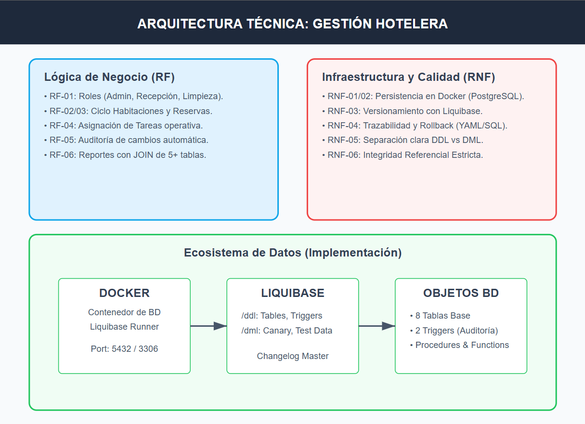

# REQUERIMIENTOS
### Requerimientos Funcionales (RF)
* RF-01 Gestión de Usuarios: El sistema debe permitir el registro de empleados con roles específicos (Administrador, Recepcionista, Limpieza, Auditor).

* RF-02 Control de Habitaciones: El sistema debe permitir la actualización del estado de las habitaciones (Disponible, Sucia, Ocupada, Mantenimiento).

* RF-03 Registro de Reservas: El sistema debe registrar las entradas y salidas de huéspedes para activar el ciclo de limpieza.

* RF-04 Asignación de Tareas: El sistema debe permitir asignar personal de limpieza a habitaciones con estado "Sucia".

* RF-05 Auditoría de Cambios: El sistema debe registrar automáticamente quién, cuándo y qué cambio se realizó en el estado de una habitación.

* RF-06 Reportes de Disponibilidad: El sistema debe generar reportes cruzando datos de habitaciones, empleados y tiempos de limpieza.

### Requerimientos No Funcionales (RNF) — Centrados en BD
* RNF-01 Persistencia de Datos: El sistema debe utilizar un motor de base de datos relacional (PostgreSQL o MySQL) para garantizar la integridad de los datos.

* RNF-02 Despliegue en Contenedores: La base de datos debe ser completamente reproducible y ejecutable mediante Docker y Docker Compose.

* RNF-03 Versionamiento de Esquema: Todos los cambios en la estructura de la base de datos (DDL) y la carga de datos (DML) deben gestionarse a través de Liquibase.

* RNF-04 Trazabilidad de Cambios (Rollback): El sistema debe permitir revertir cambios en el esquema de la base de datos mediante scripts de rollback funcionales.

* RNF-05 Separación de Scripts: Debe existir una separación física y lógica entre los scripts de definición de datos (DDL) y los de manipulación de datos (DML).

* RNF-06 Integridad Referencial: Se deben implementar llaves primarias, foráneas y restricciones (CHECK, UNIQUE, NOT NULL) para proteger la calidad de la información.

