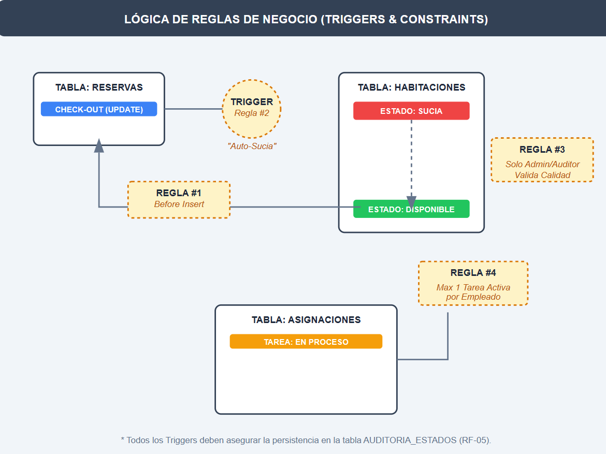

# Reglas de Negocio
* Validación de Disponibilidad: No se permite insertar una reserva si la habitación no está en estado "Disponible".

* Automatización de Suciedad: Al marcar el fin de una reserva, la habitación debe pasar automáticamente a "Sucia".

* Jerarquía de Roles: Solo el "Auditor" o "Admin" puede pasar una habitación de "En Limpieza" a "Disponible" tras verificar la calidad.

* Restricción de Asignación: Un empleado de limpieza no puede tener más de una tarea activa (estado "En Proceso") simultáneamente.
