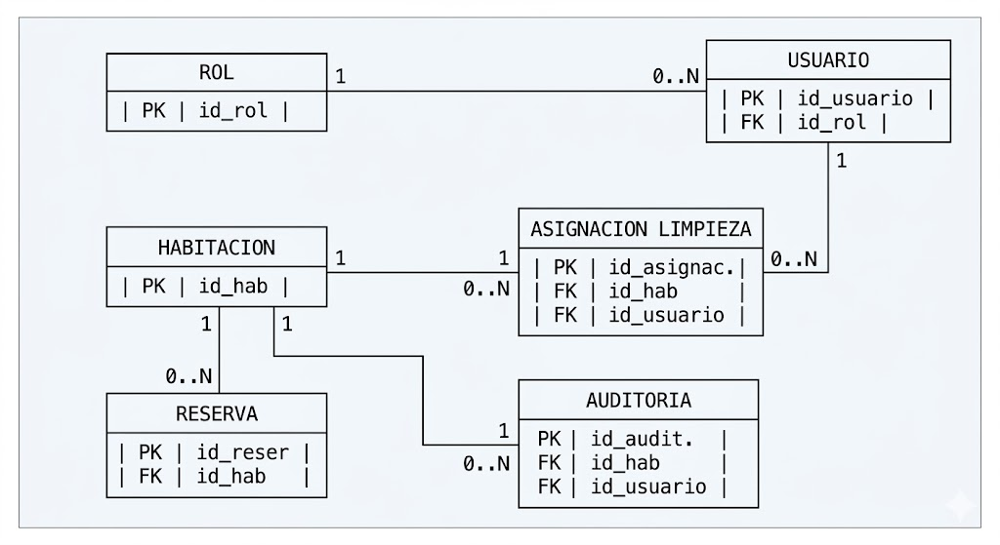

# 05. Modelo Conceptual

Este documento define el Modelo Conceptual de Datos para el sistema de gestión hotelera, sirviendo como el puente entre los requerimientos del negocio y el diseño lógico/físico de la base de datos. Su objetivo es identificar las entidades clave, sus atributos esenciales y las relaciones que gobiernan el dominio del proyecto.

## 1. Descripción del Problema y Contexto del Negocio
La gestión hotelera convencional sufre de latencia de información debido a la desconexión entre el software de recepción y el personal operativo tras el *Check-out* de los huéspedes. Este modelo conceptual captura la estructura de datos necesaria para centralizar la información, eliminar la actualización manual de disponibilidad y automatizar el ciclo de vida de los estados de las habitaciones mediante un flujo reactivo y auditable.

El núcleo del sistema radica en el rastreo en tiempo real del estado de las habitaciones (Disponible, Ocupada, Sucia, Mantenimiento), la asignación eficiente de tareas al personal de limpieza y la trazabilidad milimétrica de los tiempos de ejecución y auditoría de calidad.

## 2. Reglas de Negocio Aplicadas al Modelo
Para garantizar la consistencia de los datos a nivel conceptual, se mapean las siguientes restricciones del dominio:

* **RN-01 (Validación de Disponibilidad):** No se puede asociar una habitación a una nueva reserva si su estado actual es diferente de "Disponible".
* **RN-02 (Automatización de Suciedad):** El registro del fin de una estancia (Check-out) en una reserva desencadena el cambio de estado de la habitación afectada a "Sucia".
* **RN-03 (Jerarquía de Roles y Validación):** La transición de una habitación al estado "Disponible" requiere una validación de control de calidad, la cual solo puede ser efectuada por un usuario con rol "Auditor" o "Admin".
* **RN-04 (Restricción de Asignación):** Un empleado con rol de "Limpieza" puede tener múltiples tareas asignadas históricamente, pero conceptualmente solo puede poseer una única asignación activa (en estado "En Proceso") a la vez.

## 3. Entidades y Atributos (Diccionario Conceptual)

A continuación, se definen las entidades identificadas para satisfacer los requerimientos funcionales:

### 3.1. Rol (Entidad Fuerte)
Define los perfiles de acceso y responsabilidades dentro del hotel.
* **Atributos:**
    * `id_rol` (Identificador / Clave Primaria)
    * `nombre_rol` (Descriptivo: Administrador, Recepcionista, Limpieza, Auditor)

### 3.2. Usuario / Empleado (Entidad Fuerte)
Personal operativo y administrativo encargado de interactuar con el sistema.
* **Atributos:**
    * `id_usuario` (Identificador / Clave Primaria)
    * `nombre` (Descriptivo, Obligatorio)
    * `apellido` (Descriptivo, Obligatorio)
    * `correo_electronico` (Descriptivo, Único)
    * `contraseña` (Descriptivo)

### 3.3. Habitación (Entidad Fuerte)
Unidad física del hotel sujeta a control de disponibilidad y mantenimiento.
* **Atributos:**
    * `id_habitacion` (Identificador / Clave Primaria)
    * `numero_habitacion` (Descriptivo, Único)
    * `tipo_habitacion` (Descriptivo)
    * `precio_base` (Monetario)
    * `estado_actual` (Descriptivo: Disponible, Sucia, Ocupada, Mantenimiento)

### 3.4. Reserva (Entidad Fuerte / Vinculación de Negocio)
Registro que gestiona las estancias de los huéspedes y activa el ciclo operativo del hotel.
* **Atributos:**
    * `id_reserva` (Identificador / Clave Primaria)
    * `nombre_huesped` (Descriptivo)
    * `documento_huesped` (Descriptivo)
    * `fecha_checkin` (Temporal)
    * `fecha_checkout` (Temporal)
    * `estado_reserva` (Descriptivo: Activa, Finalizada, Cancelada)

### 3.5. Asignación de Limpieza (Entidad Débil / Intermedia de Proceso)
Registra la orden operativa de higienización de una habitación asignada a un empleado de limpieza, capturando métricas de tiempo.
* **Atributos:**
    * `id_asignacion` (Identificador / Clave Primaria)
    * `fecha_asignacion` (Temporal)
    * `hora_inicio` (Temporal, Opcional hasta la ejecución)
    * `hora_fin` (Temporal, Opcional hasta la conclusión)
    * `estado_tarea` (Descriptivo: Pendiente, En Proceso, Completada)

### 3.6. Auditoría de Estados (Entidad Débil por Dependencia)
Historial inmutable destinado a registrar de forma automatizada la traza de cambios de estado para el control de calidad.
* **Atributos:**
    * `id_auditoria` (Identificador / Clave Primaria)
    * `estado_anterior` (Descriptivo)
    * `estado_nuevo` (Descriptivo)
    * `fecha_cambio` (Temporal / Marca de tiempo)

## 4. Relaciones y Cardinalidades

Para articular el comportamiento entre las entidades, se establecen los siguientes vínculos conceptuales:

* **Rol - posee - Usuarios (1:N):** * Un **Rol** puede ser asignado a muchos **Usuarios** (ej. múltiples empleados con rol "Limpieza"). Un **Usuario** pertenece obligatoriamente a un único **Rol**.
* **Habitación - genera - Reservas (1:N):** * Una **Habitación** puede registrar muchas **Reservas** a lo largo del tiempo, pero una **Reserva** en un periodo específico se asocia a una única **Habitación**.
* **Usuario (Limpieza) - ejecuta - Asignaciones de Limpieza (1:N):**
    * Un **Usuario** con rol operativo puede recibir de cero a muchas **Asignaciones de Limpieza** a lo largo de su jornada. Cada **Asignación** está vinculada a un único **Usuario** específico.
* **Habitación - recibe - Asignaciones de Limpieza (1:N):**
    * Una **Habitación** (en estado "Sucia") puede requerir muchas **Asignaciones de Limpieza** a lo largo del historial del hotel. Una **Asignación** se ejecuta sobre una única **Habitación**.
* **Habitación - registra - Auditorías de Estado (1:N):**
    * Una **Habitación** genera múltiples registros en la traza de **Auditoría de Estados** cada vez que su situación operativa varía. Cada registro de **Auditoría** detalla el cambio de una única **Habitación**.
* **Usuario (Autor de Cambio) - genera - Auditorías de Estado (1:N):**
    * Un **Usuario** (Recepcionista, Personal de Limpieza, Auditor o Administrador) puede provocar directa o indirectamente muchas entradas de **Auditoría de Estado**. Cada registro de **Auditoría** debe identificar de forma inequívoca al **Usuario** responsable de la acción.

## 5. Diagrama Entidad-Relación (MER Conceptual - Notación Crow's Foot)
